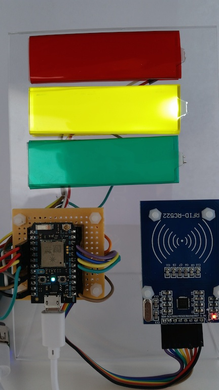

#Project: Sending xAPI statements directly from an NFC card reader

## About this Project
In 2013, a very smart man by the name of Kris Rockwell built an [RFID reader
using an Arduino board](http://www.hybrid-learning.com/labs/2013/01/08/using-arduino-to-report-experience-api-statements/).  The device would read data from RFID cards, and use an intermediary server to receive webservice calls from the Arduino, translate that information into an xAPI statement and send it along to the LRS.  He ended the article by asking "Where do we go from here?"

So my goal was to answer that question.  But I set some additional goals.  My build had to accomplish five things:
1. Use only the micro-controller to run everything.  No intermediary servers
2. Build an xAPI statement based on sensor data, then send that statement to an LRS
3. Build an xAPI query based on sensor data, then send the query to an LRS
4. Take a physical action (light an LED, or operate a servo motor) based on the result of the xAPI query
5. Must be able to operate as a headless unit.  No display required

This is what I came up with:

##My Rig
I connected an RC522 MiFare card scanner to a Particle Photon micro-controller.  When you scan the MiFare card or fob, the Photon builds an xAPI statement to tell the LRS that the card was scanned.  In this example, it says The Front Door (where I would have this scanner) scanned the card, using the card ID as the object.  It tells the user that it's "thinking" by illuminating the yellow LED:

After telling the LRS that the card was scanned, We need to see if the card holder is allowed in or not.  So the Photon builds an xAPI query looking for the last statement sent to the LRS where "admin@omnesnet.com" was the actor and the card ID was the object.  Then the code searches the result for the word "approved."  If found, the Photon will illuminate the Green LED:

If "approved" is not found, then you get denied:

I cheat a little here, though.  Basically, if the query result has the word "approved" in it, then you get in.  If it doesn't, then you get denied.   This way, I don't have to parse out the actual verb that was used.  This isn't very good code or practice, I know.  But I'm doing this to illustrate the xAPI process, not good security policy!

It is built to be headless, so you do not need to have the device connected to a computer to run it.  However, it I do have extensive serial debug statements, so if you do connect a computer to it to monitor the serial output, you can see what's happening as it steps through the code.

##What I learned
I learned this was a hoot to build.  Frustrating as hell at a few points.  You do have to be a little careful how big the xAPI statements and queries get.  So take memory into account.  I don't do any garbage collection as I thought it would get in the way of illustrating the xAPI functions.  Again, in a real-world setting, I'd take better care to manage that.

My LRS of choice was a Raspberry Pi Zero, running ADL's open LRS software.  That set up is slow.  10-12 seconds to get the statement, process it, and send a result.  So I had to build in delays in a couple spots.  Otherwise, the Photon would run through all of this too fast.  I upgraded my LRS to a Pi 3 running [Learning Locker](http://docs.learninglocker.net/installation/) LRS, and that was a LOT faster.  I still had to build in a short delay.  But it went from almost 30 seconds per card scan, to around 7 seconds.

Lastly, I found an issue with the xAPI specification itself.  You can have two agents in a statement.  So, say we're playing the game tag.  I can send the statement "Anthony tagged Craig" where Anthony and Craig are both defined as agents, me being the actor (tagger) and Craig being the Object (tagee).  HOWEVER, you cannot *QUERY* on two agents.  So if I wanted to send a query to an LRS asking "When did Anthony tag Craig," I can't do it directly.  I'd have to either send a query where Anthony is the Actor, or Craig is the object, then parse the results for the statement(s) I want.  I didn't realize this when I starting building this, so originally, I used the card ID's as agents so I could use them in another project.  But... that didn't work out.  So now the cards are sent as activities.  Bummer.

All in all, I enjoyed the project.  I met my five goals.  I feel like I carried forward the spirit of the work that Mr. Rockwell started.  And I learned some stuff along the way.  Wins all around.

##Parts

Here are the two main boards I used to make all this work: 
[Particle Photon](https://store.particle.io/) - Arduino-compatible micro-controller that has built-in Wifi support.
[Mifare RC522 Card Reader](http://www.ebay.com/itm/Mifare-RC522-Card-Read-Antenna-RF-Module-RFID-Reader-IC-Card-Proximity-Module-/311563538690)

Other parts used were:
[LED Backlights](https://www.adafruit.com/products/1622) - Used to signal if the card is accepted or not.  But any LEDs would work.
[RadioShack Mini Board](https://www.radioshack.com/products/dual-mini-board) - Basically, this is to mount the Photon to the plexiglass stand.
[0.1" Female Headers](https://www.adafruit.com/products/598) - Used to attach the Photon to the Mini Board.
Various leads to connect everything together.
3 mm mounting hardware
I wrapped the LED backlights in gel sheets.  Any sheet will do, I used [these.](http://www.amazon.com/dp/B00W93FQNM/ref=cm_sw_su_dp)

###NOTE:  The code provided here is meant to illustrate the steps to build and send the xAPI statements.  So... it's not great code.  It works fine.  But it's clearly not optimized, and, really, there are better ways to have done some of the tasks involved.  But I laid out the code this way so it was, in my opinion, easier to read.  If you want to build an actual production-ready product, you'll want to tighten up the code some.  A lot.  And... don't cheat when it comes to security policies.

If you have any questions about any part of this project, please feel free to reach out to me either here or directly.  Thanks for visiting!

--anthony
